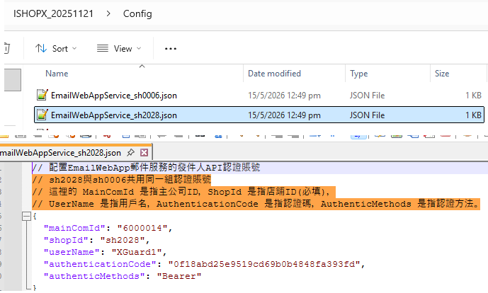

# 💖郵件發送API（SendMail）文檔

## ♒️介面概述

此介面為第三方系統提供郵件傳送能力，部署在 `/MailService/SendMail` 路徑下，並採用 HTTP POST 方法呼叫。介面需透過 `mainComId` 驗證呼叫方合法性，並透過 Header 中的 Bearer Token 完成身分認證，最終根據傳入的郵件參數完成郵件傳送。

## ♒️介面資訊

| 項 | 說明 |
|-------------|--------------------------------------------------------------------|
| 請求路徑 | `/MailService/SendMail` |
| 請求方法 | POST |
| 內容類型 | application/json（請求體需為 JSON 格式） |
| 認證方式 | Bearer Token（透過 Header 的 Authorization 欄位傳遞） |
| 適用情境 | 第三方系統存取調用，非本機系統使用 |

## ♒️請求頭說明

| 欄位名稱 | 必選 | 類型 | 說明 |
|----------------|----------------|--------|--------------------------------------------------------------------------------|
| Authorization | 是 | String | 格式為 `Bearer {token}`，其中 `token` 為與 `mainComId` 綁定的認證碼 |

## 請求體參數（SendingEmailModel）

```
 public class AuthenticUserModel
 {
     [Required]
     public string MainComId { get; set; } = string.Empty;
     [Required]
     public string ShopId { get; set; } = string.Empty;
     [Required]
     public string UserName { get; set; } = string.Empty;
     [Required]
     public string AuthenticationCode { get; set; } = string.Empty;
     [Required]
     public string AuthenticMethods { get; set; } = "Bearer";
 }
 
例如 IshopX WebShop 平台， /Config/EmailWebAppService_sh0006.json 是通過店鋪ShopId 獲得配置： 
內容如下：
// 配置EmailWebApp郵件服務的發件人API認證賬號
// sh2028與sh0006共用同一組認證賬號
// 這裡的 MainComId 是指主公司ID，ShopId 是指店鋪ID(必填)，
// UserName 是指用戶名，AuthenticationCode 是指認證碼，AuthenticMethods 是指認證方法。
{
  "mainComId": "6000014",
  "shopId": "sh0006",
  "userName": "XGuard1",
  "authenticationCode": "0f18abd25e9519cd69b0b4848fa393fd",
  "authenticMethods": "Bearer"
}

```



| 參數名稱 | 必選 | 類型 | 說明 |
|-------------------|----------------|--------|--------------------------------------------------------------------------------|
| MainComId | 是 | String | 呼叫方唯一標識，需事先設定並關聯認證資訊；傳入後會自動移除首尾空格。 |
| ShopId | N/A | String | 針對 IshopX WebShop 平台而設置的，MainComId 下的多個店鋪（ShopId）, 如果其它平台，這個屬性目前不適用。 |
| LanguageCode | 否 | String | 郵件語言編碼，預設值為 `zh-HK`（繁體中文-香港） |
| MailTemplateEnum | 否 | String | 郵件模板枚舉值，可選枚舉項需符合 `MailTemplateEnum` 定義；若傳入無效值會回傳錯誤；傳入 `NO_TEMPLATE` 表示無模板 |
| Mailto | 否 | String | 收件者信箱位址；多個信箱以英文逗號 `,` 分隔；若為空則使用預設測試信箱 |
| Subject | 否 | String | 郵件主題；若使用模板，主題可能由模板覆蓋（取決於模板配置） |
| EmailContent | 否 | String | 郵件正文內容；若使用模板，內容可能由模板填入（取決於模板配置） |
| CallbackUrlEncode | 否 | String | 回呼URL（編碼後）；可為 null，用於郵件模板中的連結替換等場景 |

## ♒️反應體格式（ResponseModalX）

響應體為 JSON 格式，結構如下：
```json
{
 "meta": {
 "Success": true/false,
 "Message": "提示訊息",
 "ErrorCode": 數字錯誤碼
 },
 "data": {}
}
```

### ♒️回應元資料（meta）說明

| 欄位名稱 | 類型 | 說明 |
|------------|---------|--------------------------------------------------------------------|
| Success | Boolean | 介面呼叫結果：true 表示郵件傳送成功，false 表示失敗 |
| Message | String | 結果描述：成功時返回“郵件已成功發送”，失敗時返回具體錯誤原因 |
| ErrorCode | Integer | 錯誤碼：0 表示成功；1 表示通用失敗；500 表示內部異常；其他值為業務錯誤碼 |

### ♒️回應資料（data）說明

目前版本 `data` 欄位為空對象，後續可擴充回傳郵件傳送流水號、收件者回執等資訊。

## ♒️錯誤碼與提示訊息說明

| 錯誤碼 | 提示訊息 | 原因說明 |
|--------|----------------------------------------------------|----------------------------------------------------------------|
| 1 | 郵件發送失敗 | 通用發送失敗（非參數/認證類錯誤） |
| 1 | 請提供有效的郵件參數 | 請求體為空（emailModel 為 null） |
| 1 | 缺少必要參數：mainComId | MainComId 參數為空或未傳遞 |
| 1 | 無效的 mainComId，未找到對應的認證使用者資訊 | MainComId 未在系統設定的認證清單中符合 |
| 1 | 請在Header中提供Authorization: Bearer {token} | 未傳遞 Authorization 請求頭 |
| 1 | Authorization格式錯誤，請使用 Bearer {token} | Authorization 格式不符合 Bearer Token 規格 |
| 1 | 無效的Token：{token} | Token 與 mainComId 綁定的認證碼不符 |
| 1 | 無效的郵件範本類型：{xxx},或傳入 NO_TEMPLATE | MailTemplateEnum 參數值無效 |
| 1 | 郵件發送失敗，請檢查日誌 | 郵件服務執行傳送操作後回傳失敗（需查看系統日誌定位原因） |
| 500 | 內部錯誤：{異常資訊} | 介面執行過程中拋出未捕獲的異常（如郵件服務初始化失敗等） |
| 0 | 郵件已成功發送 | 郵件發送成功 |

## 🔵呼叫範例

### 1. 🔶正確呼叫範例（curl）

```
『`bash
curl --location --request POST 'http://{網域/IP}:{連接埠}/MailService/SendMail' \
--header 'Authorization: Bearer abc123456789' \
--header 'Content-Type: application/json' \
--data-raw '{
 "MainComId": "TEST001",
 "LanguageCode": "zh-HK",
 "MailTemplateEnum": "NO_TEMPLATE",
 "Mailto": "test1@example.com,test2@example.com",
 "Subject": "測試郵件主題",
 "EmailContent": "這是一封測試郵件的正文內容"
}'
```

### 2. 🔶成功回應範例

```
json
{
 "meta": {
 "Success": true,
 "Message": "郵件已成功發送",
 "ErrorCode": 0
 },
 "data": {}
}
```

### 3. 🔶失敗回應範例（無效Token）

```json
{
 "meta": {
 "Success": false,
 "Message": "無效的Token：abc987654321",
 "ErrorCode": 1
 },
 "data": {}
}
```

## 💖注意事項

1. `mainComId` 需事先在系統中配置，且需與 Token 一一對應，否則會認證失敗；
2. Token 需嚴格保密，第三方系統需妥善保管，避免外洩；
3. 收件者信箱格式需符合標準，否則可能導致郵件傳送失敗（介面僅做分隔處理，不校驗信箱格式）；
4. 郵件範本枚舉值需與系統定義的 `MailTemplateEnum` 完全相符（大小字母敏感）；
5. 介面日誌會記錄 `mainComId`、呼叫時間、異常資訊等，以便於問題排查；
6. 若使用預設測試郵箱，需確認測試郵箱的可用性，生產環境需替換為實際收件者配置。